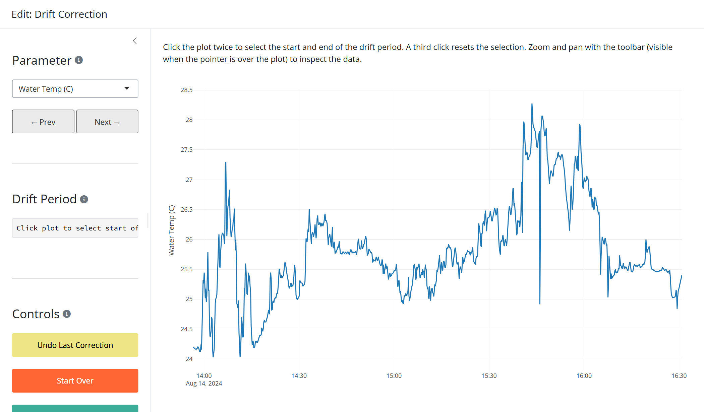

```{r}
#| label: setup
#| include: false
#| message: false
#| warning: false
library(AquaSensR)
```

Continuous water quality sensors are subject to gradual drift over a deployment period, a slow systematic shift in readings caused by biofouling, membrane degradation, reagent depletion, or general sensor ageing. Left uncorrected, drift produces a time series that appears plausible but is consistently biased by an amount that grows over time.

AquaSensR provides two functions for drift correction:

- `utilASRdrift()`: Applies a single linear drift correction to one parameter programmatically.
- `editASRdrift()`: Opens an interactive Shiny app that guides you through corrections for each parameter and returns the corrected data when the app is closed.

## The correction algorithm

The standard field procedure for detecting drift involves a **post-deployment calibration check**: when a sensor is retrieved, a freshly calibrated reference instrument is placed in the water alongside it and both readings are recorded. The difference between the two readings is the accumulated drift.

AquaSensR distributes that drift correction linearly across the deployment window, on the assumption that drift accumulates at a roughly constant rate. The correction applied at row $i$ within the window is:

$$
\text{adj}_i = \text{sensor}_i + (\text{cal\_ref} - \text{cal\_check}) \times \frac{i - i_{\min}}{i_{\max} - i_{\min}}
$$

where:

| Term | Description |
|------|-------------|
| $\text{sensor}_i$ | The original sensor reading at row $i$ |
| $\text{cal\_ref}$ | The true value measured by the independent reference instrument at deployment end |
| $\text{cal\_check}$ | What the deployed sensor was reading at the end of the window (inferred from the data) |
| $\frac{i - i_{\min}}{i_{\max} - i_{\min}}$ | Position within the window: 0 at the start, 1 at the end |

The correction is zero at the start of the window and equal to $\text{cal\_ref} - \text{cal\_check}$ at the end. The `cal_check` value is inferred automatically from the sensor data at `drift_end_time`, so the only value the user needs to supply is `cal_ref`.

## Load the data

The examples below use the example file bundled with the package:

```{r}
contpth <- system.file("extdata/ExampleCont1.xlsx", package = "AquaSensR")
contdat <- readASRcont(contpth)
```

## `utilASRdrift()` for programmatic correction

`utilASRdrift()` applies a drift correction to a single parameter over a specified time window and returns the corrected `contdat`.

### Arguments

| Argument | Description |
|----------|-------------|
| `cont` | `contdat` data frame returned by `readASRcont()` |
| `param` | Name of the parameter column to correct |
| `cal_ref` | True value from the independent reference instrument at deployment end |
| `drift_start_time` | Start of the drift window (POSIXct or coercible) |
| `drift_end_time` | End of the drift window (POSIXct or coercible) |

### Basic usage

Pass the data, the parameter name, the reference value, and the deployment start and end times:

```{r}
t1 <- min(contdat$DateTime)
t2 <- max(contdat$DateTime)

corrected <- utilASRdrift(contdat, "Water_Temp_C", cal_ref = 24.0, t1, t2)
```

Verify the two key invariants of the correction: the start value is unchanged and the end value equals `cal_ref`:

```{r}
# Start of window: no correction applied
contdat$Water_Temp_C[contdat$DateTime == t1]
corrected$Water_Temp_C[corrected$DateTime == t1]

# End of window: corrected to cal_ref
corrected$Water_Temp_C[corrected$DateTime == t2]
```

### Output

`utilASRdrift()` returns a copy of `cont` with the corrected values replacing the originals in the drift window. All other columns and all rows outside the window are unchanged.

### Visualising the correction

Pass `plot = TRUE` to display a plotly chart alongside the corrected data. The plot shows the full corrected time series (blue), the original sensor values within the drift window (gray), and the supplied reference value at the end of the window (red circle).

```{r}
corrected <- utilASRdrift(
  contdat,
  "Water_Temp_C",
  cal_ref = 24.0,
  drift_start_time = t1,
  drift_end_time = t2,
  plot = TRUE
)
```

The corrected data frame is still returned as before.

### Multiple deployment periods

If a monitoring record spans more than one deployment (i.e., the sensor was retrieved, checked, and redeployed mid-record), apply corrections sequentially, one call per deployment period:

```r
# First deployment
corrected <- utilASRdrift(contdat, "Water_Temp_C",
                          cal_ref = 24.0,
                          drift_start_time = deploy1_start,
                          drift_end_time   = deploy1_end)

# Second deployment, applied to the already-corrected data
corrected <- utilASRdrift(corrected, "Water_Temp_C",
                          cal_ref = 23.5,
                          drift_start_time = deploy2_start,
                          drift_end_time   = deploy2_end)
```

Each correction operates independently on its own window, so the order matters only when windows overlap (which they should not for distinct deployments).

## `editASRdrift()` for interactive correction

`editASRdrift()` opens a Shiny application that walks through drift correction parameter by parameter. This is the recommended approach when working with real monitoring data, because it allows visual identification of the drift period and immediate confirmation that the correction looks right before moving on.

```r
drift_result <- editASRdrift(contdat)
```

### Interface overview

{fig-alt="Screenshot of the editASRdrift Shiny app showing the time series plot and left sidebar." width="100%"}

The app has a left sidebar for controls and a main plot area showing the current parameter's time series.

**Correcting a drift period:**

1. Zoom and pan with the plot toolbar (visible when the pointer is over the plot) to locate the drift period.
2. **Click once** on the plot to mark the start of the drift window. A red dashed vertical line appears.
3. **Click again** to mark the end. A purple dashed vertical line appears and the reference value input becomes visible in the sidebar.
4. Enter the **Reference value** (the reading from the independent calibrated instrument at the end of the deployment).
5. Click **Apply Correction**. The plot updates immediately to show the corrected time series. The original (pre-correction) values for the window are retained as a solid gray line for visual comparison, and a red circle marks the supplied reference value at the end of the window. These elements are for display only and are not included in the returned data.

A third click resets the selection so you can start over without applying a correction.

Multiple corrections can be applied to the same parameter (e.g., one per deployment period). Each is recorded separately in the corrections log and can be individually undone.

### Sidebar controls

| Control | Action |
|---------|--------|
| **Parameter** | Drop-down selector to switch between parameters.  Prev/Next buttons cycle through all available parameters.  Corrections are preserved independently for each parameter. |
| **Drift Period** | Displays the currently selected start and end times. |
| **Reference value** | Appears once two times are selected.  Enter the true value from the independent reference instrument at the end of the deployment. |
| **Apply Correction** | Applies the linear drift correction to the selected window and updates the plot. |
| **Undo Last Correction** | Reverses the most recently applied correction for the current parameter. |
| **Start Over** | Restores all original values for every parameter and clears the corrections log. |
| **Export Progress** | Saves the current corrected data and corrections log as Excel files in a ZIP archive. |
| **Done / Close** | Stops the app and returns the corrected data and corrections summary to the R session. |

### Corrections log

The sidebar shows a running table of every correction applied during the session, across all parameters. Each row records the parameter name, drift window start and end, the supplied `cal_ref`, the inferred `cal_check`, and the total drift applied (`cal_ref - cal_check`). This log is included in the return value and in the Export Progress ZIP.

### Return value

`editASRdrift()` returns a named list with two elements:

| Element | Description |
|---------|-------------|
| `contdat` | The `contdat` data frame sorted by `DateTime`, with all drift-corrected values replacing the originals. |
| `corrections` | A data frame summarising every correction applied, with columns `Parameter`, `drift_start`, `drift_end`, `cal_ref`, `cal_check`, and `drift_applied`. |

```r
# Inspect the corrected time series
head(drift_result$contdat)

# Review the corrections that were applied
drift_result$corrections
```

The `corrections` data frame provides a complete audit trail of every change made during the session, which can be saved alongside the corrected data for documentation purposes.
